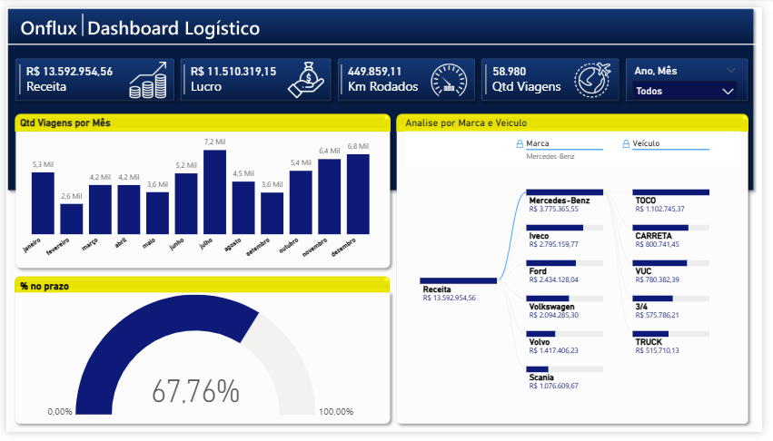
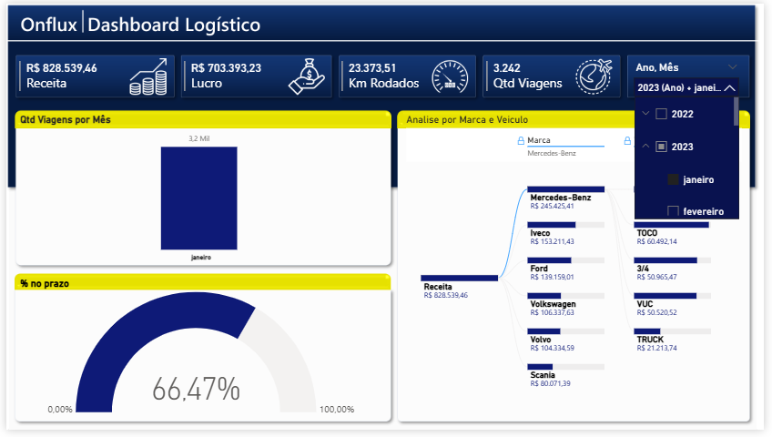
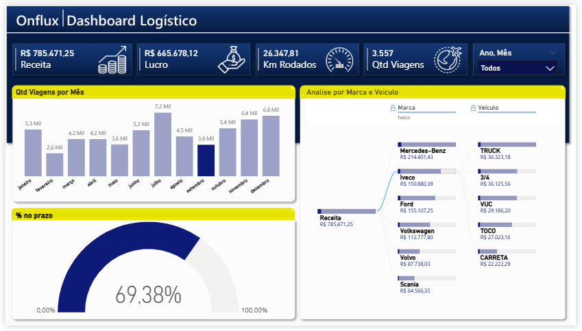

# 📊 Dashboard de Logística – Análise de Entregas

## 📌 Visão Geral
Projeto de **estudo pessoal** desenvolvido em Power BI, com foco na análise de entregas ao longo do tempo.  
O objetivo é explorar dados logísticos, aplicar boas práticas de visualização e transformar informações  
em insights claros para apoio à tomada de decisão.

---

## 🎯 Objetivo do Projeto
- Analisar o volume de entregas por mês  
- Acompanhar a evolução das entregas ao longo do tempo  
- Explorar dados de forma interativa  
- Praticar modelagem básica de dados e criação de métricas no Power BI  

---

## 🛠️ Ferramentas Utilizadas
- Power BI Desktop  
- Power Query  
- DAX (medidas básicas)  
- Fonte de dados em CSV/Excel (dados fictícios)  

---

## 📈 Principais Métricas e Análises
- Total de entregas  
- Entregas por mês  
- Análise temporal de desempenho  
- Filtros interativos para exploração dos dados  

---

## 📷 Preview do Dashboard

---

## ⚠️ Observações
- Os dados utilizados são **fictícios**  
- Projeto com finalidade de **aprendizado e estudo pessoal**  
- O arquivo PDF é apenas uma visualização estática do dashboard  

---

## 🚀 Próximos Passos
- Adicionar novas métricas e indicadores  
- Criar novas páginas analíticas  
- Aprimorar medidas DAX  
- Evoluir o layout e o storytelling visual  
